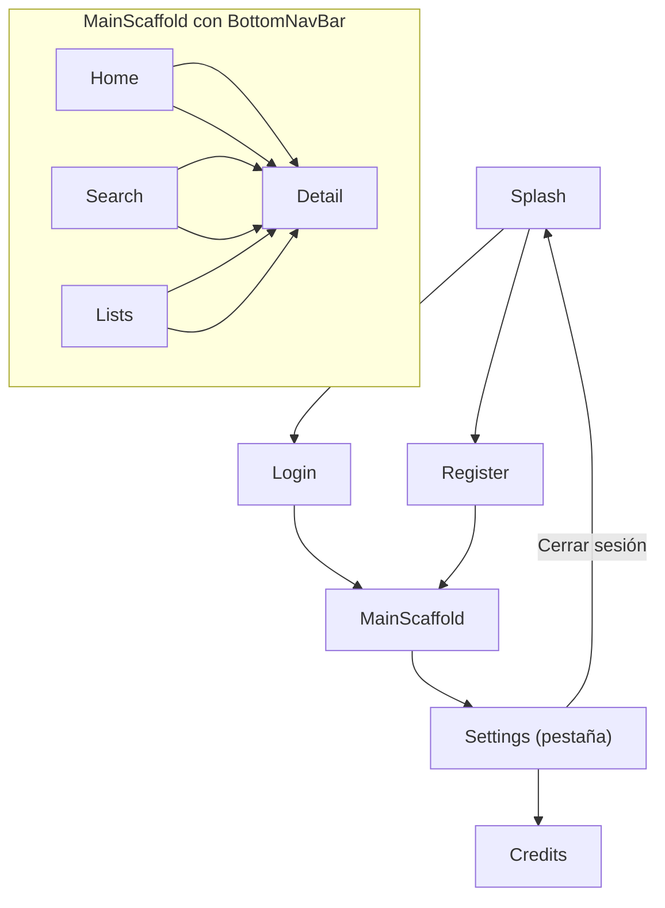

# RECO — Plan: Pantallas Restantes + Correcciones

## Estado actual y problemas a corregir

Antes de las pantallas nuevas hay cosas quemadas que deben quedar dinámicas:

| Elemento quemado | Dónde | Corrección |
|---|---|---|
| `userName = "Ana"` | `HomeUiModel` | Leer el nombre guardado en `RegisterViewModel` vía `UserPreferences` (DataStore) |
| `onMovieTap = { _, _ -> }` | `MainScaffold` | Conectar a la ruta `Screen.Detail` cuando esté creada |
| `onSeeAll = {}` (no-op) | `HomeScreen` | Navegar a `SearchScreen` pre-filtrada |
| `Screen.Detail` ausente | `Screen.kt` | Añadir con args `mediaType` + `id` |
| `signOut()` ausente | `AuthRepository` | Añadir función (sin-op por ahora, listo para Firebase) |

---

## Flujo de navegación completo



`Detail` y `Credits` están en el `NavHost` raíz (sin barra inferior). Se navega a ellos desde `MainScaffold` via el `NavController` raíz, que se pasa hacia abajo.

---

## 1. Correcciones en archivos existentes

### `Screen.kt`

Añadir:
```kotlin
data object Credits : Screen("credits")
data object Detail : Screen("detail/{mediaType}/{id}") {
    const val MEDIA_TYPE_ARG = "mediaType"
    const val ID_ARG = "id"
    fun buildRoute(mediaType: String, id: Int) = "detail/$mediaType/$id"
}
```

### `data/preferences/UserPreferences.kt` (nuevo)

Similar a `ThemePreferences`, guarda en el mismo `DataStore` (`reco_preferences`) la clave `user_name`. Al registrarse, el `RegisterViewModel` guarda el nombre. Al cargar Home, `HomeViewModel` lo lee.

Claves nuevas en DataStore:
- `user_name` — nombre ingresado en el registro
- `fav_movie_ids` — set de IDs de películas marcadas como favoritas (usado en Listas)
- `platform_subscriptions` — set de Platform labels activas (usado en Ajustes)
- `notif_recommendations` / `notif_releases` — booleans de notificaciones

### `RegisterViewModel.kt`

Agregar constructor con `UserPreferences` e inyectarlo en la `Factory`. Al completar el registro exitoso, llamar `userPreferences.setUserName(name)`.

### `HomeViewModel.kt`

Cambiar `HomeUiModel.userName` para que lo lea desde `UserPreferences.userName: Flow<String>` (con default `"tú"` en vez de `"Ana"`).

### `MainScaffold.kt`

Recibir `onNavigateToDetail: (mediaType: String, id: Int) -> Unit` y conectarlo al `onMovieTap` de `HomeScreen` y al futuro `SearchScreen` y `ListsScreen`.

### `NavGraph.kt` (`RecoNavHost`)

Añadir rutas:
```kotlin
composable(
    route = Screen.Detail.route,
    arguments = listOf(
        navArgument(Screen.Detail.MEDIA_TYPE_ARG) { type = NavType.StringType },
        navArgument(Screen.Detail.ID_ARG) { type = NavType.IntType },
    ),
) { backStackEntry ->
    val mediaType = backStackEntry.arguments?.getString(Screen.Detail.MEDIA_TYPE_ARG) ?: "movie"
    val id = backStackEntry.arguments?.getInt(Screen.Detail.ID_ARG) ?: 0
    DetailScreen(mediaType = mediaType, id = id, onBack = { navController.popBackStack() })
}
composable(Screen.Credits.route) {
    CreditsScreen(onBack = { navController.popBackStack() })
}
```

Pasar a `MainScaffold` el callback de navegación raíz:
```kotlin
composable(Screen.Main.route) {
    MainScaffold(
        movieRepository = movieRepository,
        onNavigateToDetail = { mt, id ->
            navController.navigate(Screen.Detail.buildRoute(mt, id))
        },
        onNavigateToCredits = {
            navController.navigate(Screen.Credits.route)
        },
        onSignOut = {
            authRepository.signOut()
            navController.navigate(Screen.Splash.route) {
                popUpTo(0) { inclusive = true }
            }
        },
    )
}
```

---

## 2. Nuevos archivos de datos / preferencias

### `data/preferences/UserPreferences.kt`

Comparte el DataStore `reco_preferences` ya definido en `ThemePreferences.kt`. Expone:
- `userName: Flow<String>` (default `"tú"`)
- `favoritesIds: Flow<Set<String>>` — IDs de `"mediaType:id"` marcados como favorito
- `platformSubscriptions: Flow<Set<String>>` — Platform labels activos
- `notifRecommendations: Flow<Boolean>`, `notifReleases: Flow<Boolean>`
- Funciones `set*` correspondientes

> Importante: el `preferencesDataStore` ya está declarado en `ThemePreferences`. Hay que mover la propiedad de extensión a un objeto singleton o archivo separado para no declararlo dos veces.

**Solución:** Crear `data/preferences/RecoDataStore.kt` con el `val Context.recoDataStore` y eliminar la declaración privada de `ThemePreferences.kt`. Tanto `ThemePreferences` como `UserPreferences` usarán el mismo `Context.recoDataStore`.

---

## 3. Pantalla: Buscar (`SearchScreen`)

**Archivos:** `ui/screens/search/SearchScreen.kt` + `SearchViewModel.kt`

**SearchViewModel:**
- `_query: MutableStateFlow<String>` — debounce 400ms
- `_selectedGenre: MutableStateFlow<String?>` — null = "Todos"
- `state: StateFlow<UiState<List<Movie>>>` — llama `repo.search(query)`, filtra por género localmente
- `fun updateQuery(q: String)` / `fun selectGenre(g: String?)`

**SearchScreen layout (del diseño):**
- Título "Buscar"
- `RecoTextField` estilizado con ícono lupa (`Icons.Default.Search`) como `leadingIcon`, placeholder "Películas, series, personas…"
- `LazyRow` de `GenreChip` para filtros: Todos, Drama, Acción, Comedia, Sci-Fi
- `LazyVerticalGrid(columns = Fixed(2))` de `PosterCard` en aspecto 2:3
- Estado vacío ("No se encontraron resultados") y loading/error al igual que Home
- Bottom nav visible (pestaña Buscar activa)

---

## 4. Pantalla: Detalle (`DetailScreen`)

**Archivos:** `ui/screens/detail/DetailScreen.kt` + `DetailViewModel.kt`

**Problema de datos:** TMDB no devuelve runtime ni plataformas en la ruta `/trending`. Se añade al `MovieRepository`:
```kotlin
suspend fun getMovieDetail(id: Int): Result<Movie>   // GET movie/{id}
suspend fun getTvDetail(id: Int): Result<Movie>       // GET tv/{id}
```
DTOs nuevos `MovieDetailDto` / `TvDetailDto` con `runtime`, `genres`, `overview`.

Si `TMDB_API_KEY` está vacío, busca en `demoMovies()` por id.

**DetailViewModel:**
- `state: StateFlow<UiState<Movie>>` — carga `getDetail(mediaType, id)`
- Función `load()` llamada en `init`
- Las reseñas son **mock** hardcodeadas por id (mismas 2 del diseño: María G. y Carlos R.) hasta conectar Firebase/reseñas reales

**DetailScreen layout (del diseño):**
- `Box` scrollable `fillMaxSize`
- Header 280dp: `AsyncImage` backdrop con degradado `detail-grad-top → bg`, flecha atrás absoluta top-left
- Overlapping row `bottom = -60.dp`: poster `120×180dp` sombra + borde, columna con título, meta ("año · runtime · género"), badges de plataforma
- Body con `padding(top = 90.dp, horizontal = 20.dp)`:
  - Row de `RatingPill`: IMDb X.X, RT XX%, RECO X.X (accent)
  - `RecoPrimaryButton` "▶ Ver trailer" — abre `Intent(ACTION_VIEW, Uri)` con búsqueda en YouTube
  - Sinopsis `bodyLarge`
  - Sección "Reseñas" con cards (autor, estrellas en accent, texto)
- Sin `BottomNavBar`

**Nuevo componente `RatingPill.kt`:** capsule con `surfaceVariant`, texto pequeño bold.

---

## 5. Pantalla: Listas (`ListsScreen`)

**Archivos:** `ui/screens/lists/ListsScreen.kt` + `ListsViewModel.kt`

**ListsViewModel:**
- Inyecta `UserPreferences` (via factory) y `MovieRepository`
- `favorites: StateFlow<List<Movie>>` — mapea `favoritesIds` Flow → carga cada película del repo (o busca en caché de trending si ya cargado)
- `fun toggleFavorite(movie: Movie)` — añade/quita `"mediaType:id"` de `UserPreferences`

Para las listas personalizadas ("Para ver este fin de semana") se usa un **`MutableStateFlow<Map<String, List<String>>>`** almacenado en DataStore como JSON serializado (lista de entradas `nombre → lista de ids`). Solo se implementa la vista; la creación de nueva lista abre un `AlertDialog` con un campo de texto.

**ListsScreen layout (del diseño):**
- Título "Mis listas" + subtítulo "Organiza lo que quieres ver"
- `RecoSecondaryButton` "+ Nueva lista" — abre Dialog
- `LazyColumn` con dos secciones:
  - **Listas del usuario** (tarjeta con 3 thumbnails de póster, chevron, meta texto)
  - **Mis favoritos** (cada ítem: poster 56×84dp, título, badges, botón corazón `IconButton` toggle)
- Bottom nav (pestaña Listas activa)

---

## 6. Pantalla: Ajustes (`SettingsScreen`)

**Archivos:** `ui/screens/settings/SettingsScreen.kt` + `SettingsViewModel.kt`

**SettingsViewModel:**
- Inyecta `UserPreferences`, `ThemePreferences`
- `userName: StateFlow<String>`, `notifReco: StateFlow<Boolean>`, `notifReleases: StateFlow<Boolean>`
- `platformSubs: StateFlow<Set<String>>`
- `themeMode: StateFlow<ThemeMode>` (de `ThemePreferences`)
- Funciones: `setNotifReco`, `setNotifReleases`, `togglePlatform(Platform)`, `setTheme(ThemeMode)`

**SettingsScreen layout (del diseño):**
- Título "Ajustes"
- Avatar 64dp + nombre + email + "Editar perfil" (link — a futuro)
- Sección **NOTIFICACIONES** (card agrupada):
  - "Nuevas recomendaciones" + `Switch`
  - "Estrenos en tus géneros" + `Switch`
- Sección **MIS PLATAFORMAS** (card agrupada):
  - Fila por cada `Platform`: badge + nombre + `Switch`
  - Estado persistido en `UserPreferences`
- Fila "Apariencia": tres chips o `SegmentedButton` (Sistema / Claro / Oscuro) conectado a `ThemeViewModel` de `MainActivity`
- Fila "Cambiar contraseña" → Snackbar "Correo de restablecimiento enviado" (llama `AuthRepository.sendPasswordResetEmail`)
- Fila "Créditos del proyecto" → `onNavigateToCredits()`
- "Cerrar sesión" (rojo accent, centrado) → `onSignOut()`
- Bottom nav (pestaña Ajustes activa)

> Para el toggle de tema, `SettingsScreen` recibe `themeMode` y `onThemeChange` como parámetros (los provee `MainScaffold` desde `ThemeViewModel`).

---

## 7. Pantalla: Créditos (`CreditsScreen`)

**Archivo:** `ui/screens/credits/CreditsScreen.kt` (sin ViewModel — todo estático)

**Layout (del diseño):**
- Back arrow "← Ajustes"
- Logo centrado: `Box` 64dp, gradiente rojo, "R"
- `h2` "RECO" + subtítulo "Proyecto académico — Kotlin / Android"
- `h3` "Equipo" (centrado)
- 3 cards de miembro: nombre, rol, email (datos a rellenar por el equipo)
- Card institución: universidad, facultad, año
- Pie "Gracias por usar RECO."
- Sin bottom nav

---

## 8. Nuevo componente `RatingPill.kt`

```kotlin
@Composable
fun RatingPill(text: String, modifier: Modifier = Modifier, isAccent: Boolean = false)
```
Capsule `surfaceVariant`, texto `bodyMedium` bold, color normal o `primary` si `isAccent`.

---

## Estructura de archivos nuevos/modificados

```
app/src/main/java/com/reco/app/
├── data/
│   ├── preferences/
│   │   ├── RecoDataStore.kt           ← NUEVO (mueve extensión Context.recoDataStore)
│   │   ├── ThemePreferences.kt        ← MODIFICA (quitar extensión DataStore privada)
│   │   └── UserPreferences.kt         ← NUEVO
│   ├── remote/
│   │   └── TmdbDto.kt                 ← MODIFICA (añadir MovieDetailDto, TvDetailDto)
│   ├── remote/TmdbApi.kt              ← MODIFICA (añadir endpoints GET movie/{id} y tv/{id})
│   └── repository/
│       └── MovieRepository.kt         ← MODIFICA (añadir getMovieDetail / getTvDetail)
├── navigation/
│   ├── Screen.kt                      ← MODIFICA (añadir Detail con args, Credits)
│   ├── NavGraph.kt                    ← MODIFICA (rutas Detail/Credits + callbacks)
│   └── MainScaffold.kt                ← MODIFICA (onNavigateToDetail, onNavigateToCredits, onSignOut, ThemeViewModel)
├── ui/
│   ├── components/
│   │   └── RatingPill.kt              ← NUEVO
│   └── screens/
│       ├── home/HomeViewModel.kt      ← MODIFICA (userName desde UserPreferences)
│       ├── auth/RegisterViewModel.kt  ← MODIFICA (guardar nombre en UserPreferences)
│       ├── search/
│       │   ├── SearchScreen.kt        ← NUEVO
│       │   └── SearchViewModel.kt     ← NUEVO
│       ├── detail/
│       │   ├── DetailScreen.kt        ← NUEVO
│       │   └── DetailViewModel.kt     ← NUEVO
│       ├── lists/
│       │   ├── ListsScreen.kt         ← NUEVO
│       │   └── ListsViewModel.kt      ← NUEVO
│       ├── settings/
│       │   ├── SettingsScreen.kt      ← NUEVO
│       │   └── SettingsViewModel.kt   ← NUEVO
│       └── credits/
│           └── CreditsScreen.kt       ← NUEVO
```
